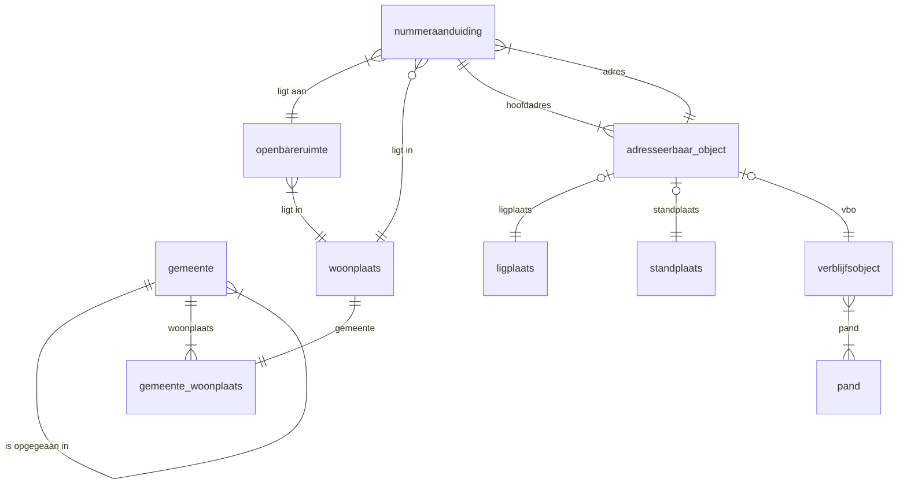

# bag_duckdb
Dit dbt-project bouwt via standen (extract landelijke voorziening) een bronspiegel op van de BAG. De databaseobjecten bevinden zich in het databaseschema `bag`. Dit project is opgezet om de python mogelijkheden van dbt-duckdb te testen, analoog aan de python mogelijk heden voor dbt-snowflake, dbt-redshift en dbt-bigtable. Om zo lokaal een BAG omgeving op te zetten met dbt en de opgedane kennis te hergebruiken.

## dbt modellen (`models/`)

### Documentatie (`documentatie/`)
Hier staan alle markdown bestanden t.b.v. de documentatie van de dbt modellen.

### Landing zone (`landingzone/`)
De landing zone bevat de modellen van het type 'source' in dbt en bevat de metadata voor de rauwe BAG-data.
In de dbt project yaml staat het pad naar de gedownloade BAG data. Daarvoor staan er scripts in de `scripts/loader/stand/data`-folder.
Met de scripts `download` en `download_proefbestand` is het mogelijk om het reguliere of het proef bestand te downloaden naar de `scripts/loader/stand/data`-folder.

### Staging stand (`staging\stand\`)
Voor het laden van de standen zijn verschillende python en sql dbt modellen aangemaakt met de bijbehorende configuratie in de stand.yml.
Type python modellen:
- via een xpath configuratie uit de yaml wordt de XML ingelezen in een DuckDB tabel. (leverings- en gemeente woonplaats data)
- via de st_read functie uit de spatial module van DuckDB worden de BAG XML data bestanden ingelezen.
Eén sql model om de gemeente data in te lezen uit het csv bestand.

