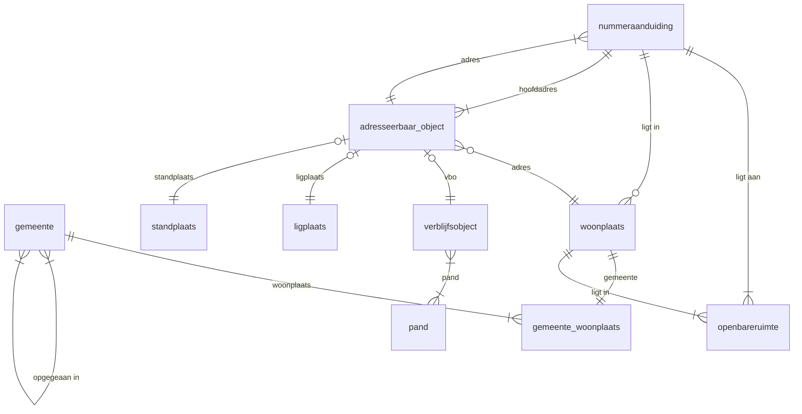

# bag_duckdb
Dit dbt-project bouwt via standen (extract landelijke voorziening) een bronspiegel op van de BAG. De databaseobjecten bevinden zich in het databaseschema `bag`.

## Lagen (`models/`)

### Landing zone (source)
De landing zone is een model van het type 'source' in dbt en bevat de rauwe BAG-data. Er is een typed en untyped variant.
* de *untyped* variant bestaat uit een tabel met mutatieberichten (XML) die verderop in de staging geparsed worden
* de *typed* variant bestaat uit een tabel per BAG-objecttype met een kolom per attribuut

De typed variant zal normaalgesproken voor de standen worden gebruikt en de untyped variant voor de mutaties. Maar in principe maakt dit niet uit.

De landing zone bevindt zich in het databaseschema `lz_bag`. Omdat het een dbt-model van het type 'source' betreft wordt de DDL buiten dbt om gecreëerd. Daarvoor staan er SQL-scripts in de `scripts/`-folder.

Elke tabel in de landing zone kent een kolom `_etl_loaded_at`. Deze is van belang voor de auditeerbaarheid en voor het incrementeel laden.

Stand laden (volledige extract of proefbestand):

    cd scripts/loader/stand/
    ./load.sh

Mutaties laden (één XML-voorbeeldbericht):

    cd scripts/loader/mutatie
    cat insert_mutatiebericht.sql| psql bag

Het laden van de landing zone gebeurt met een loader, buiten dbt om, zie verderop.

In principe zou de landing zone leegemaakt kunnen worden nadat de bronspiegel (en/of snapshot) is bijgewerkt. We verwerken namelijk geen verwijderingen (deze komen immers niet voor in de BAG). De verwerking kijkt alleen naar regels in de landing zone die een nieuwere `_etl_loaded_at` hebben dan reeds aanwezig in de bronspiegel.

