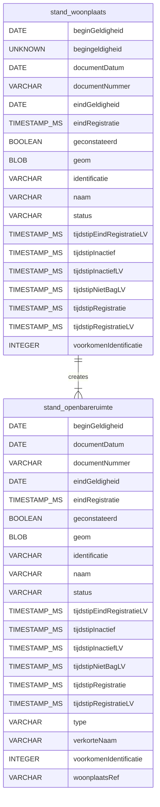

```mermaid
erDiagram
	stand_woonplaats ||--|{ stand_openbareruimte : "creates"

	stand_woonplaats {
		DATE beginGeldigheid
		UNKNOWN begingeldigheid
		DATE documentDatum
		VARCHAR documentNummer
		DATE eindGeldigheid
		TIMESTAMP_MS eindRegistratie
		BOOLEAN geconstateerd
		BLOB geom
		VARCHAR identificatie
		VARCHAR naam
		VARCHAR status
		TIMESTAMP_MS tijdstipEindRegistratieLV
		TIMESTAMP_MS tijdstipInactief
		TIMESTAMP_MS tijdstipInactiefLV
		TIMESTAMP_MS tijdstipNietBagLV
		TIMESTAMP_MS tijdstipRegistratie
		TIMESTAMP_MS tijdstipRegistratieLV
		INTEGER voorkomenIdentificatie
	}

	stand_openbareruimte {
		DATE beginGeldigheid
		DATE documentDatum
		VARCHAR documentNummer
		DATE eindGeldigheid
		TIMESTAMP_MS eindRegistratie
		BOOLEAN geconstateerd
		BLOB geom
		VARCHAR identificatie
		VARCHAR naam
		VARCHAR status
		TIMESTAMP_MS tijdstipEindRegistratieLV
		TIMESTAMP_MS tijdstipInactief
		TIMESTAMP_MS tijdstipInactiefLV
		TIMESTAMP_MS tijdstipNietBagLV
		TIMESTAMP_MS tijdstipRegistratie
		TIMESTAMP_MS tijdstipRegistratieLV
		VARCHAR type
		VARCHAR verkorteNaam
		INTEGER voorkomenIdentificatie
		VARCHAR woonplaatsRef
		}
```

		